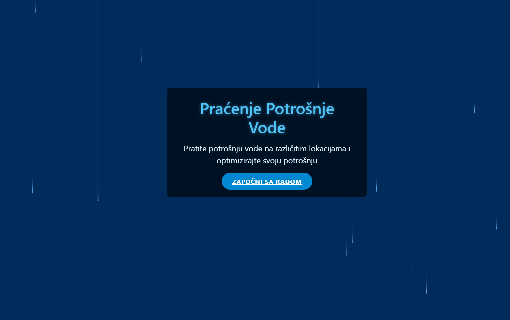
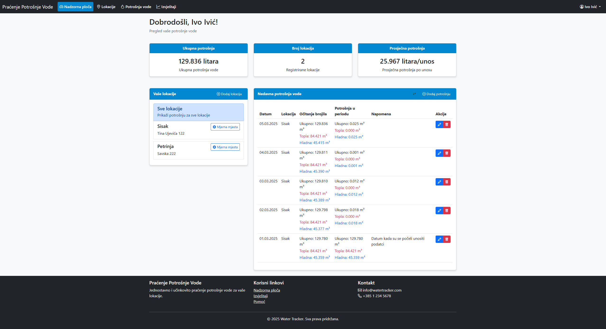
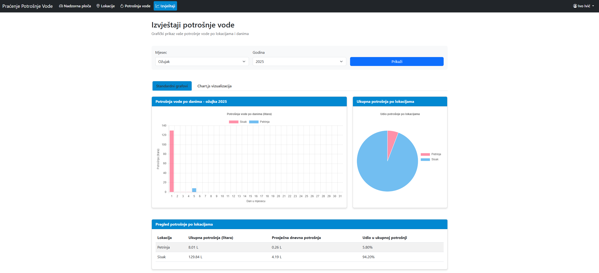

# Water Tracker

   

## 📋 O aplikaciji

Water Tracker je web aplikacija za praćenje i analizu potrošnje vode na više lokacija. Omogućuje korisnicima precizno praćenje potrošnje tople i hladne vode kroz mjerne točke, vizualizaciju podataka pomoću interaktivnih grafikona, te upravljanje detaljnim evidencijama potrošnje.

## 🎯 Cilj projekta

Glavni cilj Water Tracker aplikacije je pružiti korisnicima jednostavan, ali moćan alat za:
- Praćenje potrošnje vode kroz vrijeme
- Identifikaciju obrazaca potrošnje i trendova
- Otkrivanje potencijalnih curenja ili prekomjerne potrošnje
- Poticanje odgovornijeg korištenja vodnih resursa
- Optimizaciju troškova vode kroz bolje upravljanje potrošnjom

## ✨ Ključne funkcionalnosti

- **Upravljanje lokacijama**: Dodavanje, uređivanje i brisanje lokacija gdje se prati potrošnja vode
- **Mjerne točke**: Kreiranje više mjernih točaka za svaku lokaciju (npr. kuhinja, kupaonica)
- **Evidencija potrošnje**: Unos, uređivanje i brisanje podataka o potrošnji tople i hladne vode
- **Vizualizacija podataka**: Prikaz podataka kroz tablice, kružne grafikone, stupčaste grafikone i linijske grafove
- **Sortiranje i filtriranje**: Mogućnost filtriranja podataka po lokaciji i sortiranja po datumu
- **Autentifikacija korisnika**: Siguran pristup aplikaciji s email/lozinka autentifikacijom

## 🚀 Tehnologije

- **Backend**: Spring Boot s Controller-Service arhitekturom
- **Frontend**: Thymeleaf za generiranje HTML-a, Bootstrap za responzivni dizajn
- **Baza podataka**: H2 in-memory baza podataka (razvojna okolina)
- **Vizualizacija podataka**: JavaScript biblioteke (Chart.js)
- **Sigurnost**: Autentifikacija korisnika

## 🛠️ Pokretanje aplikacije

### Preduvjeti
- Java 11 ili novija
- Gradle 7.0 ili noviji

### Koraci za pokretanje
1. Clone repozitorij:
   ```
   git clone https://github.com/YOUR-USERNAME/watertracker.git
   cd watertracker
   ```

2. Pokrenite aplikaciju:
   ```
   ./gradlew bootRun
   ```

3. Pristupite aplikaciji:
   Otvorite web preglednik i posjetite `http://localhost:8080`

4. Pristup H2 konzoli (razvojna okolina):
   Posjetite `http://localhost:8080/h2-console` s ovim podacima:
   - JDBC URL: `jdbc:h2:mem:watertrackerdb`
   - Username: `sa`
   - Password: `password`

## 📸 Sučelje aplikacije

Snimke zaslona aplikacije koje prikazuju glavne funkcionalnosti:

### Početna stranica


### Dashboard s primjerom podataka


### Vizualizacija podataka kroz grafikone


## 👨‍💻 Autori

Bojan Pađen
